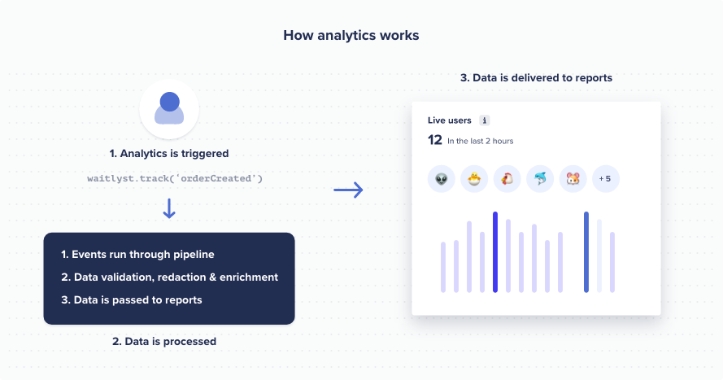

# waitlyst.js is a lighweight library for tracking product analytics.

- Track every event on your app
- Understand your users and how to improve your product

## Documentation
Please visit https://waitlyst.co/docs to view the complete documentation.

## Getting Started
This module is distributed via npm, which is bundled with node and should be installed as one of your project's dependencies.

```sh
npm install @indextrus/waitlyst.js
```

or as a script tag:
```html
<script src="https://cdn.waitlyst.co/sdk/waitlyst.js"></script>
```


## Tracking product analytics


#### Using waitlyst.js as an es module:

```ts
import { Waitlyst } from 'waitlyst-js';

const waitlyst = new Waitlyst('YOUR_PUBLISHABLE_KEY');

/* Track a page view */
waitlyst.page();

/* Track a custom event */
waitlyst.track('stockPurchase', {
    price: 3000,
    id: '1234',
    quantity: 1 
});

/* Identify a visitor */
waitlyst.identify('1234', {
    firstName: 'John',
    lastName: 'Doe',
    email: 'john@example.com
});
```

#### Using waitlyst.js as a script tag:

```html
<script src="https://cdn.waitlyst.co/sdk/waitlyst.js"></script>
<script>
    var waitlyst = new Waitlyst('YOUR_PUBLISHABLE_KEY');

    /* Track a page view */
    /* If used in a browser (non-spas) analytics will be tracked automatically */
    waitlyst.page();

    /* Track a custom event */
    waitlyst.track('stockPurchase', {
        price: 3000,
        id: '1234',
        quantity: 1 
    });

    /* Identify a visitor */
    waitlyst.identify('1234', {
        firstName: 'John',
        lastName: 'Doe',
        email: 'test@example.com'
    });
</script>
```


