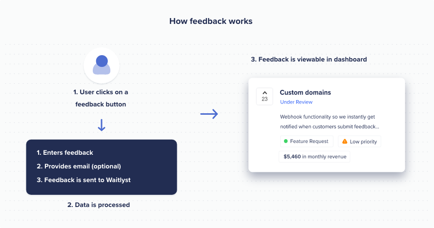

# waitlyst.js provides in-app widgets for collecting customer feedback &amp; product analytics.

- Track every event on your app
- Understand your users and how to improve your product
- Collect in-app customer feedback with 1 line of code

## Getting Started
This module is distributed via npm, which is bundled with node and should be installed as one of your project's dependencies.

```sh
npm install waitlyst-js
```

or as a script tag:
```html
<script src="https://cdn.waitlyst.co/sdk/waitlyst.js"></script>
```


## Tracking product analytics


#### Using waitlyst.js as an es module:

```ts
import { Waitlyst } from 'waitlyst-js';

const waitlyst = new Waitlyst('YOUR_PUBLISHABLE_KEY');

/* Track a page view */
waitlyst.page();

/* Track a custom event */
waitlyst.track('stockPurchase', {
    price: 3000,
    id: '1234',
    quantity: 1 
});

/* Identify a visitor */
waitlyst.identify('1234', {
    firstName: 'John',
    lastName: 'Doe',
    email: 'john@example.com
});
```

#### Using waitlyst.js as a script tag:

```html
<script src="https://cdn.waitlyst.co/sdk/waitlyst.js"></script>
<script>
    var waitlyst = new Waitlyst('YOUR_PUBLISHABLE_KEY');

    /* Track a page view */
    /* If used in a browser (non-spas) analytics will be tracked automatically */
    waitlyst.page();

    /* Track a custom event */
    waitlyst.track('stockPurchase', {
        price: 3000,
        id: '1234',
        quantity: 1 
    });

    /* Identify a visitor */
    waitlyst.identify('1234', {
        firstName: 'John',
        lastName: 'Doe',
        email: 'test@example.com'
    });
</script>
```

## Collecting customer feedback


#### Using waitlyst.js as an es module:

1. Attach a `data-waitlyst="feedback"` attribute to an element in your DOM
```html
    <button type="button" data-waitlyst="feedback">Click me</button>
```

2. Initialize waitlyst.js
```ts
import { Waitlyst } from 'waitlyst-js';

const waitlyst = new Waitlyst('YOUR_PUBLISHABLE_KEY');

// TIP: The code above must be initialized after your DOM has loaded`

// Here are some examples on where to place that code:
// Angular -> AfterViewInit
// React -> ComponentDidMount
// Jquery -> document.ready(function() { ... })
// VanillaJS -> document.addEventListener('DOMContentLoaded', callbackFunction, false);


```

#### Using waitlyst.js as an browser script tag:

1. Attach a `data-waitlyst="feedback"` attribute to an element in your DOM
```html
    <button type="button" data-waitlyst="feedback">Click me</button>
```

2. Initialize waitlyst.js
```html
<script src="https://cdn.waitlyst.co/sdk/waitlyst.js"></script>
<script>
    document.addEventListener('DOMContentLoaded', function() {
        var waitlyst = new Waitlyst('YOUR_PUBLISHABLE_KEY');
        
    });
</script>
```

### Advanced usage
You can attach ids to an element and manually trigger them. This is especially useful for displaying widgets in context when a user take a certain action or encounters an error in your app.
```html
<button type="button" data-waitlyst="feedback" id="feedback-button">Click me</button>
``` 
and then you can envoke it by:
```typescript
const waitlyst = new Waitlyst("yourPublishableKey")
// To open
waitlyst.elements.open("feedback-button");

// To close
waitlyst.elements.close("feedback-button")
```


